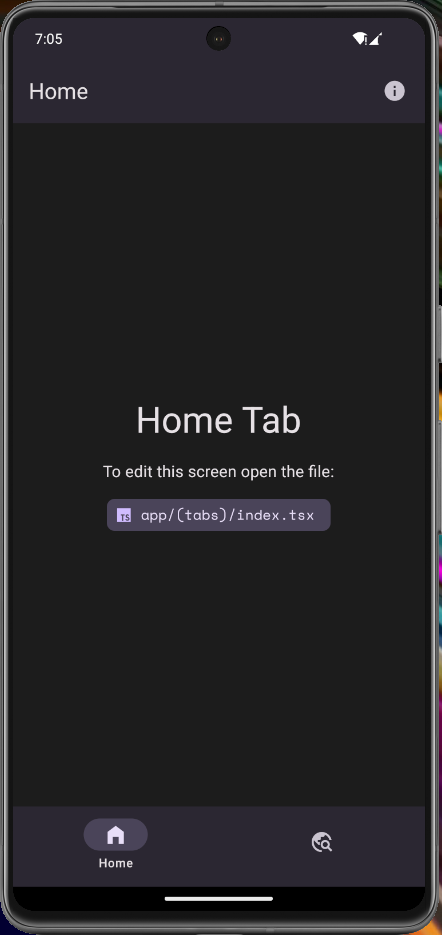
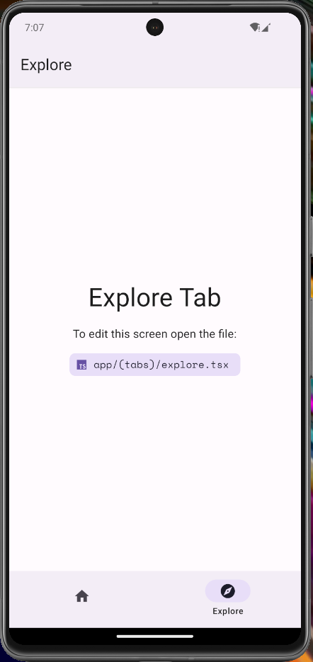
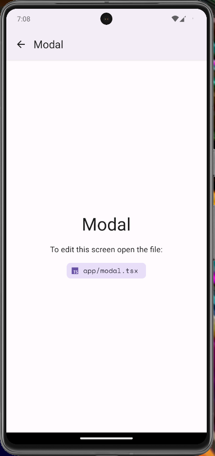

# expo-material-tabs


## Overview

The `expo-material-tabs` library is a comprehensive foundation for developing cross-platform mobile applications that integrate seamlessly with the Expo ecosystem while adhering to Material Design V3 guidelines. It provides native support for both light and dark themes, ensuring a consistent and visually appealing user experience across all supported platforms.

## Screenshots





## Key Features

- **Expo Framework**: Leverage the extensive capabilities offered by the Expo platform to streamline development processes.
- **Expo Router**: Simplify routing in modern React Native applications using an intuitive and efficient solution.
- **Material Design V3**: Align with the latest design principles for a modern and polished user interface.
- **Light & Dark Modes**: Automatically switch between themes based on user preference to enhance usability and aesthetics.
- **Cross-Platform Support**: Easily develop applications for Web, iOS, and Android with consistent functionality and appearance.
- **CI/CD Integration**: Automate build and deployment processes through integrated workflows for efficient development lifecycle management.

## Supported Platforms

- **Web**
- **iOS**
- **Android**

## Getting Started

Follow these steps to set up the project on your local machine for development and testing purposes.

### Prerequisites

Ensure that the following software is installed on your system:

- **Node.js**: A Long-Term Support (LTS) version is recommended.
- **npm** or **Yarn**: Package managers for Node.js.

### Installation

1. **Clone the Repository**

   ```bash
   git clone https://github.com/youzarsiph/expo-material-tabs.git
   ```

2. **Navigate to the Project Directory**

   ```bash
   cd expo-material-tabs
   ```

3. **Install Dependencies**

   Using npm:

   ```bash
   npm install
   ```

   Using Yarn:

   ```bash
   yarn install
   ```

4. **Start the Application**

   Using npm:

   ```bash
   npm start
   ```

   Using Yarn:

   ```bash
   yarn start
   ```

## Configuration

### Application Name

- **Configure Project Name**

  Update the `name` field in the `package.json` file to reflect your application's name.

  ```jsonc
  {
    "name": "your-app-name",
    // Additional configurations
  }
  ```

## Technologies Used

- **TypeScript**: Ensures robust and scalable code through static typing and modern language features.
- **React**: A reliable JavaScript library for building user interfaces with a focus on performance and developer experience.
- **React Native**: A powerful framework for creating native mobile applications across multiple platforms.
- **Expo**: An open-source platform for universal React applications that simplifies the development process.
- **Expo Router**: An advanced routing solution specifically designed for React Native applications.
- **React Native Paper**: UI components that adhere to Material Design guidelines, ensuring a consistent and modern look.

## Security

We take security seriously and follow best practices to protect the library and its users. Here are some key security measures:

- Regular security audits using [CodeQL](https://codeql.github.com/).
- Dependency management with [Yarn Audit](https://classic.yarnpkg.com/en/package/yarn-audit/) or [npm Audit](https://docs.npmjs.com/cli/v7/commands/npm-audit).
- Code reviews and static analysis to identify and fix security vulnerabilities.

## Roadmap

Our future goals include:

- Enhancing performance and reliability of the library.
- Introducing new features to further improve user experience.
- Expanding platform support to include additional environments.

For updates or to contribute to our roadmap, please [contact us](https://github.com/youzarsiph/expo-material-tabs/issues) or [submit a feature request](https://github.com/youzarsiph/expo-material-tabs/issues/new?template=feature_request.md).

## Contributing

We welcome contributions from the community to enhance and expand `expo-material-tabs`. To contribute, please follow these steps:

1. **Fork the Repository**
2. **Create a Feature Branch:**

   ```bash
   git checkout -b feature/AmazingFeature
   ```

3. **Commit Your Changes:**

   ```bash
   git commit -m 'Add some AmazingFeature'
   ```

4. **Push to the Branch:**

   ```bash
   git push origin feature/AmazingFeature
   ```

5. **Open a Pull Request**

Your contributions are highly valued and greatly appreciated!

## Code of Conduct

Please review our [Code of Conduct](CODE_OF_CONDUCT.md) to understand our expectations and guidelines for community interactions.

## License

This project is licensed under the MIT License. For more details, please refer to the [LICENSE](LICENSE) file.

## Contact

For any questions or inquiries, please contact the maintainers:

- **Maintainer**: Yousuf Abu Shanab
- **GitHub**: [youzarsiph](https://github.com/youzarsiph)
